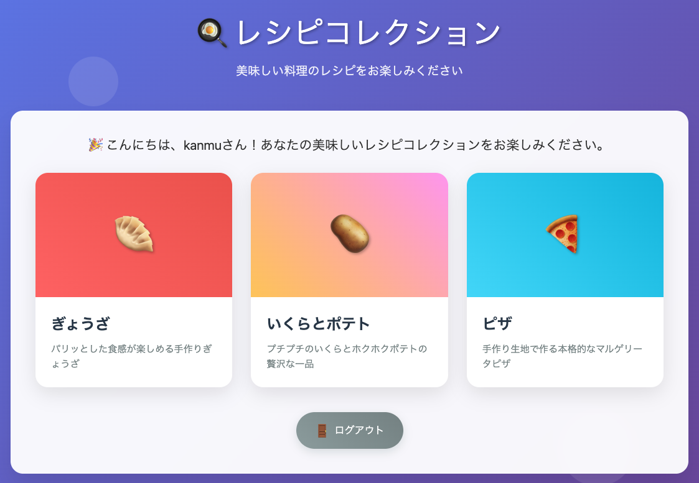

# Go Conference 2025 Capture The Flag

> [!CAUTION]
> ソースコードを読むと難易度が激減します。解答が分からなかった場合に、ソースコードをご確認ください。ヒントは、README下部に用意してあります。

## レシピサイトから Flag を探して、ノベルティをもらおう




## 準備するもの

- go 1.24 or later（[ダウンロードリンク](https://go.dev/doc/install)）

## チャレンジ方法

1. `git clone` もしくは `go install` で"gocon2025-ctf"サーバーを準備
2. "gocon2025-ctf"サーバーを起動し、`http://localhost:8080/`（レシピサイト）にアクセス
3. ユーザー名：kanmu、パスワード：gocon2025でログイン

### git cloneしてビルドする場合

```shell
git clone https://github.com/kanmu/gocon2025-ctf
cd gocon2025-ctf
go build main.go -o gocon2025-ctf
./gocon2025-ctf　
```

### go installを使う場合
```shell
go install github.com/kanmu/gocon2025-ctf@latest
gocon2025-ctf
```

## ヒント

<details><summary>ヒント1</summary>

あなたの他にもレシピを投稿しているユーザーが存在します。

</details>


<details><summary>ヒント2</summary>

GoではSQLインジェクションが起きない？そんなことはありませんよ。

</details>


<details><summary>ヒント3</summary>

どうしても分からない時には、力づくで突破することも大事です。

</details>

<details><summary>ヒント4</summary>

あなたは食材を吟味し、レシピ通りに調理するタイプでしょうか。

</details>


## 解答

Go Conference 2025 最終日の夜に公開します。
